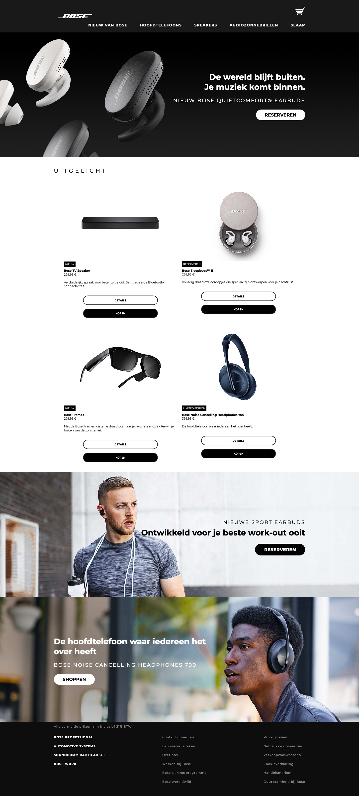
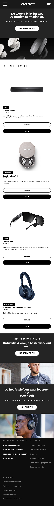
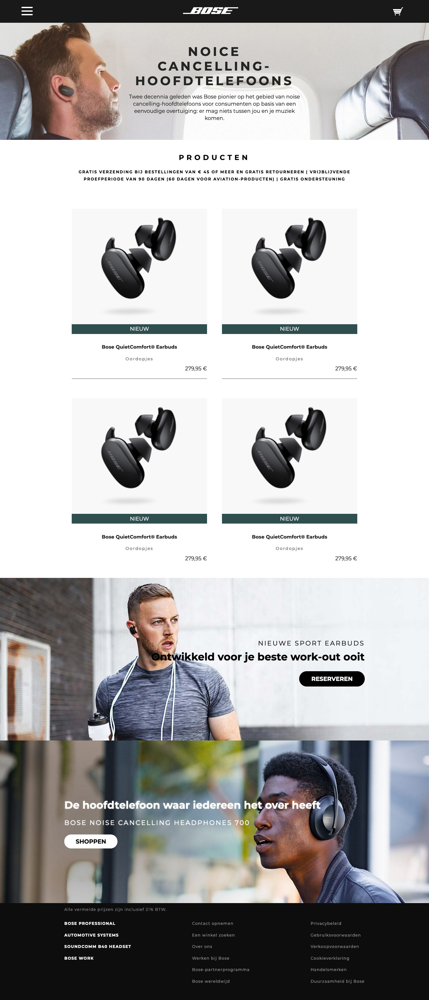
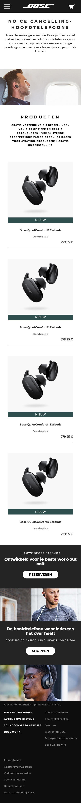

# Procesverslag
**Auteur:** Tom van den Berg

## Bronnenlijst
1. https://www.bose.nl/
2. Hamburger menu inspiratie: https://codepen.io/designcouch/pen/Atyop

## Eindgesprek (week 7/8)

Ik vind dat ik best wel tevreden kan zijn met het eindresultaat. Ik vind dat het best wel een mooie complete website is geworden. Ik had het meest moeite met het weinig gebruiken van divs en classes, omdat ik gewend was om dit veel te gebruiken.

**Screenshot(s):**

Desktop:

Mobiel:

## Voortgang 3 (week 6)

Ik heb een groot deel van de tweede pagina gemaakt. Deze is ook bijna helemaal responsive. Ik moet alleen het onderste deel nog toevoegen aan de pagina. 

Desktop:

Mobiel:

### Agenda voor meeting

Roos: 9:20-9:35 
Mila: 9:35-9:50 
Tensael: 9:50-10:05 
Tom: 10:05-10:20 
Mehmet: 10:20-10:25

### Verslag van meeting

Vasilis vond dat ik goed bezig was. Ik moest alleen nog kijken naar de focus states en ik moest echte content invoegen, zodat er geen ontwerpproblemen ontstaan. 

## Voortgang 2 (week 5)

Ik heb sinds het vorige voortgangsgesprek niet heel veel meer aan de website gewerkt. De eerste pagina is nu wel volledig responsive. Ik ga hierna beginnen met het maken van de tweede pagina. Ik denk dat dit minder werk
gaat zijn dan de eerste omdat ik een groot deel van de basis al heb gebruikt voor de eerste pagina.

Desktop:

Mobiel:

### Agenda voor meeting

Roos: 9:20-9:35 
Mila: 9:35-9:50 
Tensael: 9:50-10:05 
Tom: 10:05-10:20 
Mehmet: 10:20-10:25

### Verslag van meeting

De studentassistent had niks meer toe te voegen op mijn website. Alleen dat ik een nav moest gebruiken in plaats van div's. 

## Voortgang 1 (week 3)

### Stand van zaken

Ik ging voor mijn gevoel best wel snel door de website heen en heb daardoor een groot deel van de website gemaakt. Ik moet wat meer tijd besteden aan het volledig responsive maken, vooral voor tablet.

**Screenshot(s):**

Desktop:

Mobiel:

### Agenda voor meeting

Mehmet: 9:20-9:35 
Roos: 9:35-9:50 
Mila: 9:50-10:05 
Tensael: 10:05-10:20 
Tom: 10:20-10:25

### Verslag van meeting

De studentassistenten vertelden mij dat ik goed op weg was. Ze zeiden dat ik als ik meer uitdaging zoek even moet kijken naar SVG animaties. Ik ga dit zeker doen zodra de basis van mijn website af is.

## Intake (week 1)

**Je startniveau:** Ik ga proberen om zwart te doen

**Je focus:** In de eerste instantie ga ik voor beide. Als ik in tijdnood kom ga ik voor responsive

**Je opdracht:** Ik ga de webisite van Bose namaken: https://www.bose.nl

**Screenshot(s):**

Desktop:

Mobiel:

**Breakdown-schets(en):**

