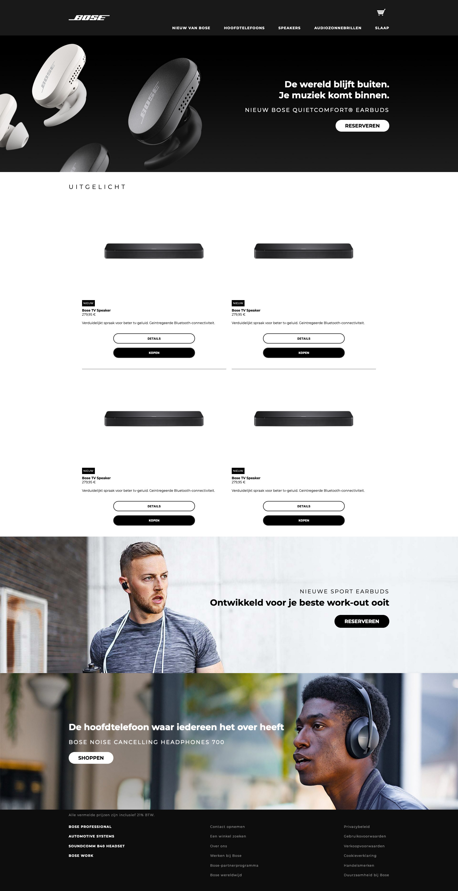
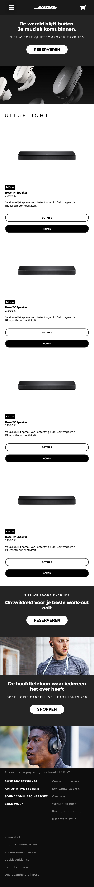
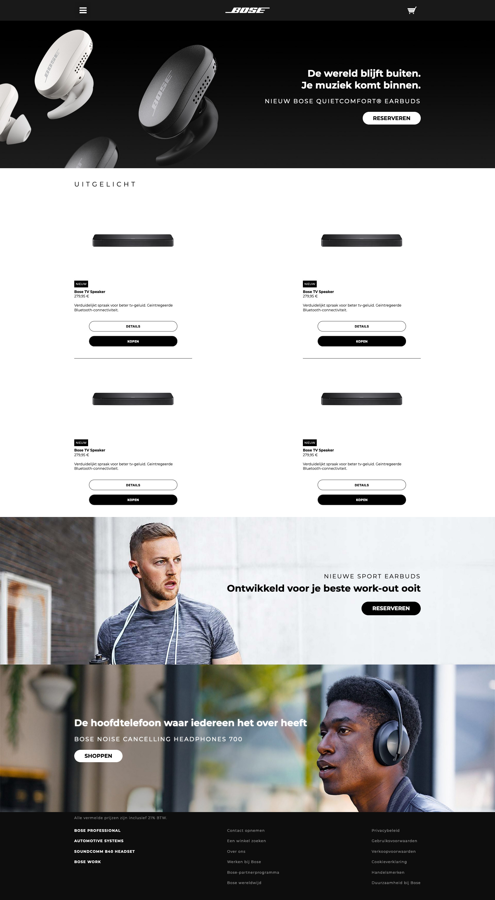
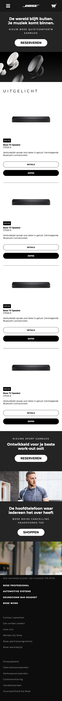
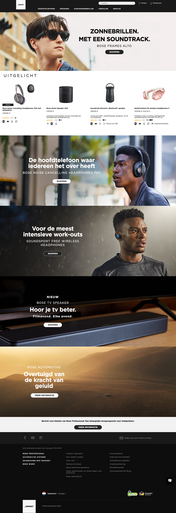
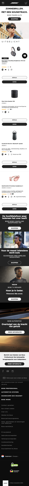
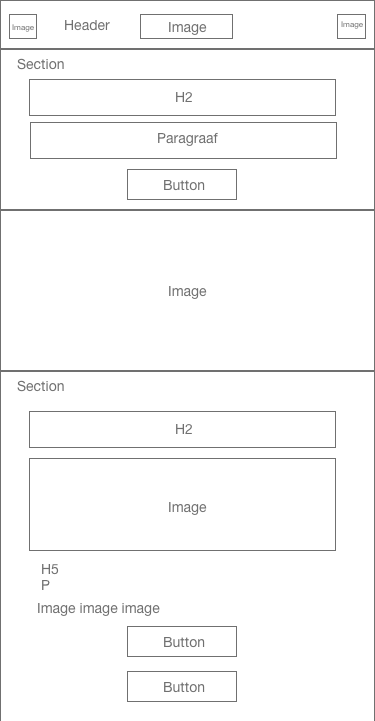

# Procesverslag
**Auteur:** Tom van den Berg

Markdown cheat cheet: [Hulp bij het schrijven van Markdown](https://github.com/adam-p/markdown-here/wiki/Markdown-Cheatsheet). Nb. de standaardstructuur en de spartaanse opmaak zijn helemaal prima. Het gaat om de inhoud van je procesverslag. Besteedt de tijd voor pracht en praal aan je website.

## Bronnenlijst
1. https://www.bose.nl/
2. -bron 2-
3. -...-

## Eindgesprek (week 7/8)

-dit ging goed & dit was lastig-

**Screenshot(s):**

-screenshot(s) van je eindresultaat-

## Voortgang 3 (week 6)

-same as voortgang 1-

## Voortgang 2 (week 5)

Ik heb sinds het vorige voortgangsgesprek niet heel veel meer aan de website gewertkt. De eerste pagina is nu wel volledig responsive. Ik ga hierna beginnen met het maken van de tweede pagina. Ik denk dat dit minder werk
gaat zijn dan de eerste omdat ik een groot deel van de basis al heb gebruikt voor de eerste pagina.

Desktop:

Mobiel:

### Agenda voor meeting

Mehmet: 9:20-9:35 
Roos: 9:35-9:50 
Mila: 9:50-10:05 
Tensael: 10:05-10:20 
Tom: 10:20-10:25

## Voortgang 1 (week 3)

### Stand van zaken

Ik ging voor mijn gevoel best wel snel door de website heen en heb daardoor een groot deel van de website gemaakt. Ik moet wat meer tijd besteden aan het volledig responsive maken, vooral voor tablet.

**Screenshot(s):**

Desktop:

Mobiel:

### Agenda voor meeting

Mehmet: 9:20-9:35 
Roos: 9:35-9:50 
Mila: 9:50-10:05 
Tensael: 10:05-10:20 
Tom: 10:20-10:25

### Verslag van meeting

De studentassistenten vertelden mij dat ik goed op weg was. Ze zeiden dat ik als ik meer uitdaging zoek even moet kijken naar SVG animaties. Ik ga dit zeker doen zodrade basis van mijn website af is.

## Intake (week 1)

**Je startniveau:** Ik ga proberen om zwart te doen

**Je focus:** In de eerste instantie ga ik voor beide. Als ik in tijdnood kom ga ik voor responsive

**Je opdracht:** Ik ga de webisite van Bose namaken: https://www.bose.nl

**Screenshot(s):**

Desktop:

Mobiel:

**Breakdown-schets(en):**

